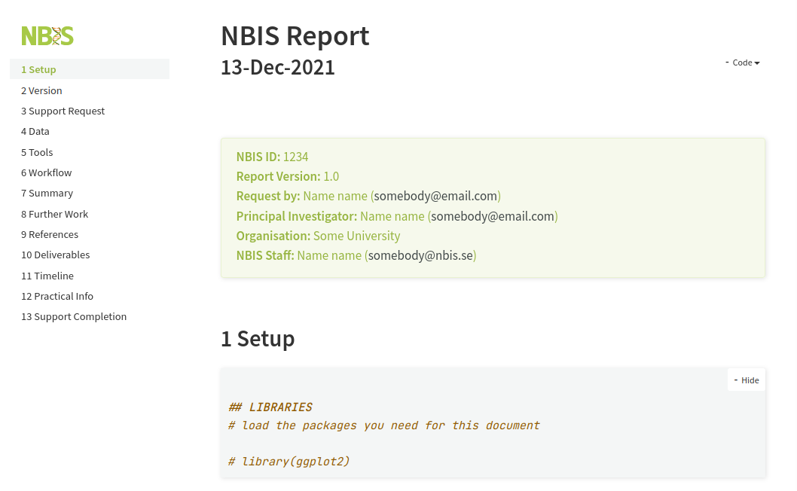
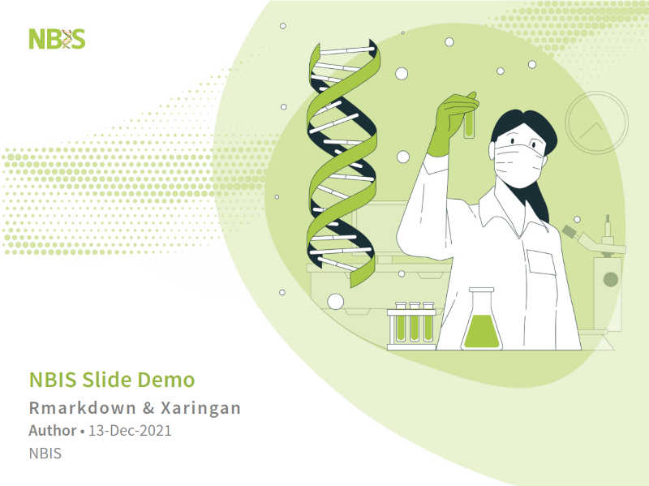

# minty  <span></span>

[](https://github.com/royfrancis/minty/actions?workflow=build)  [](https://lifecycle.r-lib.org/articles/stages.html#experimental) 

An R package with R Markdown templates for reports/documentation and slides. The GitHub repo is available at  [https://github.com/royfrancis/minty](https://github.com/royfrancis/minty).

## Templates
### nbis-report



- [Minimal preview](https://royfrancis.github.io/minty/nbis-report.html) (2.3MB)
- [Full demo](https://royfrancis.github.io/minty/nbis-report-demo.html) (15MB)

### nbis-slide



- [Minimal preview](https://royfrancis.github.io/minty/nbis-slide.html) (3.2MB)
- [Full demo](https://royfrancis.github.io/minty/nbis-slide-demo.html) (14MB)

## Usage
### Installation  

This package can be installed from R/RStudio as follows:

```
install.packages("remotes")
remotes::install_github("royfrancis/minty")
```

Supporting packages should install automatically, otherwise install manually:

```
install.packages(c("bookdown","captioner","knitr","markdown","rmarkdown","xaringan"),repos="https://cloud.r-project.org/")
```

The standard templates are to be used for preparing your own material. The 'demo' template contains detailed examples of RMarkdown syntax, features, formatting, alignment, graphics and interactive graphics. If you plan to use/render the demo template, note that it uses several extra R packages listed below. If you just want to view the rendered demo output and not render it yourself, see section 'Rendering' below.

```
install.packages(c("dplyr", "tidyr", "stringr", "kableExtra", "formattable", "DT", "highcharter", "plotly","ggiraph", "dygraphs", "networkD3", "leaflet", "crosstalk"))
```

After installing the package, restart R/Rstudio.

### Using a Template  

The templates can be accessed from within RStudio as shown below. Use this as a starting point for your own document.

`File > New File > R Markdown... > From Template > NBIS Report`

This creates a new Rmd file and assets directory in the current working directory.

### Rendering

Save the changes, say for example; **nbis-report.Rmd**, the document can be rendered to HTML by running the below in the document directory.

```
rmarkdown::render("nbis-report.Rmd")
```

This will create an HTML file: **nbis-report.html**. This HTML file is intended to be self-contained without any dependencies or assets. This behaviour is governed by the YAML argument `self_contained: true`. Depending on what you add to the report, this may not always work. The xaringan slides are self-contained too by default.

## Contact

If you have corrections, comments or suggestions, feel free to submit a report on the Github [issues](https://github.com/royfrancis/minty/issues) page.

Credit to <span></span> and <span></span> for illustrations/graphics.

---

**2022** • Roy Francis

