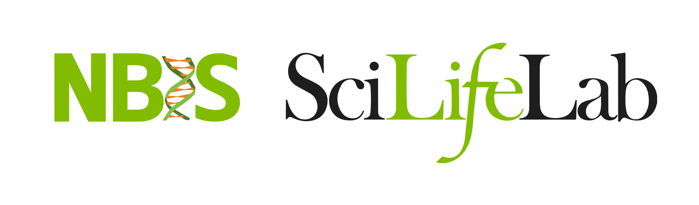

---
output:
  bookdown::html_document2:
          toc: true
          toc_float: true
          toc_depth: 4
          number_sections: true
          theme: flatly
          highlight: tango
          df_print: paged
          code_folding: "none"
          self_contained: true
          keep_md: false
          encoding: 'UTF-8'
          css: "assets/report.css"
---

```{r,include=FALSE,cache=FALSE,eval=TRUE}
## REPORT OPTIONS
## code relating to the report creation
## default working directory is the location of this document
## all code is run in the working directory as the root

# remove all variables
rm(list=ls())

# load libraries for document creation
library(knitr) # runs pandoc
library(bookdown) # for markdown
#library(captioner) # for table and figure captions
#library(extrafont) # for fonts in plots

# prepare captions
#tc <- captioner::captioner(prefix="<b>Tab. </b>")
#fc <- captioner::captioner(prefix="<b>Fig. </b>")

# set knit options
opts_knit$set(progress=TRUE,verbose=TRUE)
opts_chunk$set(dev="svg",results="hold",fig.show="hold",fig.align="left",echo=FALSE,warning=FALSE,message=FALSE,accordion=NULL,
block.title=NULL)
#options(knitr.table.format = "html")
```

```{r,include=FALSE,cache=FALSE,eval=TRUE}
# custom hooks
## collapsible panel
knitr::knit_hooks$set(accordion=function(before,options,envir) {
  if(before) {
    id <- paste0("acc",format(Sys.time(),"%Y%m%d%H%S"),sample(c(0:9),1),sample(c(0:9),1),sample(c(0:9),1),sample(c(0:9),1))
    if(is.null(options$btntype)) {btntype <- "normal"}else{btntype <- options$btntype}
    paste0('<p>',
          '<button class="btn btn-sm btn-primary btn-collapse btn-collapse-',btntype,' collapsed" type="button" data-toggle="collapse" data-target="#',id,'" aria-expanded="false" aria-controls="',id,'">',
          '</button>',
          '</p>',
          '<div class="collapse" id="',id,'">',
          '<div class="card card-body">')
  }else{
    paste0("</div>","</div>")
  }
})

## show title for code
knitr::knit_hooks$set(block.title=function(before,options,envir) {

out_class <- NULL
if(is.null(options$class.output)) {
if(options$echo) out_class <- options$engine
if((!options$echo) & (options$results != "hide")) out_class <- "Output"
}else{
  out_class <- options$class.output
}

  if(before) {
    paste0('<div class="block-title-parent"><div class="block-title small">',out_class,'</div>')
  }else{
    paste0('</div>')
  }
})
```

<!-- ----------------------- Do not edit above this ----------------------- -->

```{r,eval=TRUE,include=FALSE}

```

```{r,echo=FALSE,include=FALSE}
## LIBRARIES
# load the packages you need for this document

# library(ggplot2)

# CUSTOM VARIABLES
# custom ggplot theme
theme_report <- function (basesize=12) {
    theme_bw(base_size=basesize) %+replace%
        theme(
            panel.border=element_blank(),
            panel.grid.minor=element_blank(),
            panel.grid.major.x=element_blank(),
            legend.position="top",
            legend.direction="horizontal",
            legend.justification="right",
            strip.background=element_blank(),
            axis.ticks.y=element_blank(),
            axis.ticks.x=element_line(colour="grey60"),
		 plot.caption=element_text(hjust=0,colour="grey60",size=10),
		 plot.title=element_text(colour="grey60")
        )
}

#colours
col_sll_green <- "#95C11E"
col_sll_blue <- "#0093BD"
col_sll_orange <- "#EF7C00"
col_sll_green_light <- "#f4f8e8"
col_sll_blue_light <- "#e5f4f8"
col_sll_orange_light <- "#fdf1e5"

# project variables
rep_nbis_id <- "1234"
rep_report_version <- "1.0"
rep_request <- "Name name"
rep_request_email <- "somebody@ki.se"
rep_pi <- "Name name"
rep_pi_email <- "somebody@ki.se"
rep_org <- "Some University"
rep_nbis <- "Name name"
rep_nbis_email <- "somebody@nbis.se"
```



<h1 class="toc-ignore title">NBIS Report</h1>
<h4 class="toc-ignore subtitle">`r format(Sys.Date(),format="%d-%b-%Y")`</h4>

<br>

<div class="instruction abstract">
__NBIS ID:__ `r rep_nbis_id`   
__Report Version:__ `r rep_report_version`  
__Request by:__ `r paste0(rep_request," (",rep_request_email,")")`  
__Principal Investigator:__ `r paste0(rep_pi," (",rep_pi_email,")")`   
__Organisation:__ `r rep_org`  
__NBIS Staff:__ `r paste0(rep_nbis," (",rep_nbis_email,")")`  
</div>

<br>

# Support Request  

Request sent by the user.

# Data  

* Type of data  
* Data location
* Uppmax project ID
* Reference data used

# Tools

# Workflow

# Summary

Short summary of the work.  

# Further Work  

Further steps to be taken (if needed).

# References

Relevant references for methods, tools etc.

# Deliverables  

Files delivered to the user with descriptions.

## Directory  

```sh
.
+-- fq_raw/
+-- fq_trimmed/
+-- kallisto/
+-- mapping_star_genome/
+   +-- alignments/
+   +-- alignments_qc/
+   +-- featurecounts/
+   +-- qorts/
+   +-- rsem/
+-- qc/
+   +-- featurecounts_summary/
+   +-- fq_raw_qc
+   +-- fq_trimmed_logs
+   +-- fq_trimmed_qc
+-- salmon/
```

Total size is 70 GB.

## Description  

+ __fq_raw :__ Raw fastq files.
+ __fq_trimmed :__ Trimmed fastq files.
+ __kallisto :__ Kallisto results.
+ __mapping_star_genome :__ STAR alignment results.
+ __qc :__ Quality control results.
+ __salmon :__ Salmon results.

# Practical Info  
## Data responsibility

+ __NBIS & Uppnex: __ Unfortunately, we do not have resources to keep any files associated with the support request. We kindly suggest that you store safely the results delivered by us. In addition, we kindly ask that you remove the files from UPPMAX/UPPNEX. The main storage at UPPNEX is optimized for high-speed and parallel access, which makes it expensive and not the right place for longer time archiving. Please consider others by not taking up the expensive space. Please note that UPPMAX is a resource separate from the Bioinformatics Platform, administered by the Swedish National Infrastructure for Computing (SNIC) and SNIC-specifc project rules apply to all projects hosted at UPPMAX.   
+ __Sensitive data :__ Please note that special considerations may apply to the human-derived legally considered sensitive personal data. These should be handled according to specific laws and regulations as outlined e.g. [here](http://nbis.se/support/human-data.html).  
+ __Long-term backup :__ The responsibility for data archiving lies with universities and we recommend asking your local IT for support with long-term data archiving. Also a newly established [Data Office](https://www.scilifelab.se/data/) at SciLifeLab may be of help to discuss other options.  

## Acknowledgments

If you are presenting the results in a paper, at a workshop or conference, we kindly ask you to acknowledge us.

+ __NBIS staff__ are encouraged to be co-authors when this is merited in accordance to the ethical recommendations for authorship, e.g. [ICMJE recommendations](http://www.icmje.org/recommendations/browse/roles-and-responsibilities/defining-the-role-of-authors-and-contributors.html). If applicable, please include __Name, Surname, National Bioinformatics Infrastructure Sweden, Science for Life Laboratory, Further Affliations__, as co-author. In other cases, NBIS would be grateful if support by us is acknowledged in publications according to this example:

> "Support by NBIS (National Bioinformatics Infrastructure Sweden) is gratefully acknowledged."

+ __UPPMAX__ kindly asks you to [acknowledge UPPMAX and SNIC](https://www.uppmax.uu.se/support/faq/general-miscellaneous-faq/acknowledging-uppmax--snic--and-uppnex/). If applicable, please add:

> "The computations were performed on resources provided by SNIC through Uppsala Multidisciplinary Center for Advanced Computational Science (UPPMAX) under Project SNIC XXXX."

+ __NGI :__ For publications based on data from NGI Sweden, NGI, SciLifeLab and UPPMAX should be [acknowledged](https://ngisweden.scilifelab.se/info/faq#how-do-i-acknowledge-ngi-in-my-publication) like so:  

> "The authors would like to acknowledge support from Science for Life Laboratory (SciLifeLab), the National Genomics Infrastructure (NGI), and Uppsala Multidisciplinary Center for Advanced Computational Science (UPPMAX) for providing assistance in massive parallel sequencing and computational infrastructure."

# Support Completion  

You should soon be contacted by one of our managers, [Jessica Lindvall](jessica.lindvall@nbis.se) or [Henrik Lantz](Lantz henrik.lantz@nbis.se), with a request to close down the project in our internal system and for invoicing matters. If we do not hear from you within 30 days the project will be automatically closed and invoice sent. Again, we would like to remind you about data responsibility and acknowledgements, see sections: **Data Responsibility** and **Acknowledgments**.
  
You are welcome to come back to us with further data analysis request at any time via http://nbis.se/support/support.html.

Thank you for using NBIS.

<!-- --------------------- Do not edit this and below ---------------------- -->

</br>

<p style="text-align: left; font-size: small;">
Built on: <i class="fa fa-calendar" aria-hidden="true"></i> `r format(Sys.time(),format='%d-%b-%Y')`.
</p>

<hr/>

<div style="padding-bottom: 1.5em">
<span style="float:left; vertical-align:middle">
<b>`r format(Sys.Date(),format="%Y")`</b> • [SciLifeLab](https://www.scilifelab.se/) • [NBIS](https://nbis.se/)
</span>
</div>

```{r,eval=FALSE,echo=FALSE}
# manually run this to render this document to HTML
rmarkdown::render("nbis-report.Rmd")
# then run this to convert HTML to PDF (if needed)
#pagedown::chrome_print("nbis-report.html",output="nbis-report.pdf")
```

